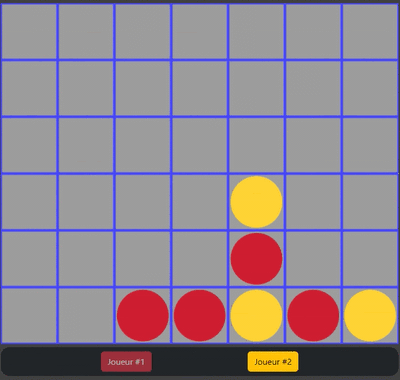
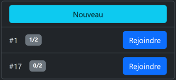

# P4

A NodeJS server hosting multiple Connect 4 game rooms.

## Table of Contents

- [Installation](#installation)
- [Usage](#usage)
- [Preview](#preview)

## Installation

```bash
git clone https://github.com/Zak4b/P4.git
cd P4
npm install
```

## Usage

```bash
npm run build
npm run start
```

## Preview

#### Game Interface



#### Room Listing


