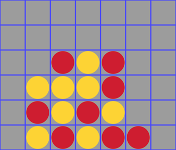

# P4

Serveur NodeJS hébergeant plusieurs salles de jeu de Puissance 4



## Table des Matières

-   [Installation](#installation)
-   [Usage](#usage)
-   [Preview](#preview)

## Installation

```bash
git clone https://github.com/Zak4b/P4.git
cd P4
npm install
```

## Usage

```bash
rpm run build
rpm run start
```

## Preview

#### Interface de jeu


#### Listing des salles


